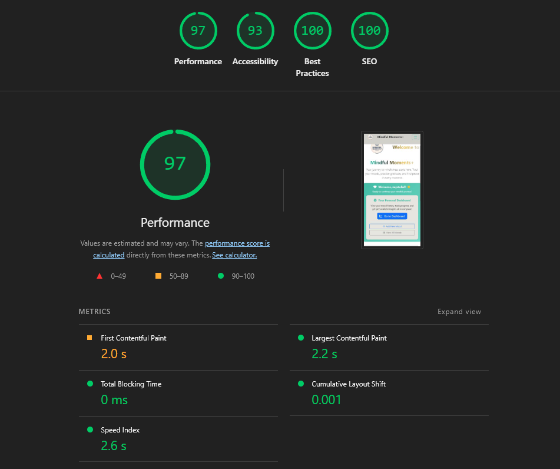

# **Mindful Moments+**

## **Project Overview**

This application is a Django-based mood tracker that was designed to help users monitor their emotional wellbeing through mindful reflection and mood logging whereever they are.

## Visit the live application: [Mindful Moments+](https://mindful-moments101-4d3848fc02ce.herokuapp.com/)

I created Mindful Moments+ to reach the goal of providing users with a simple, calming, and accessible way to track their moods, practice mindfulness, and build healthy habits wherever they are.The design of my project focuses on ease navigation, visual clarity, and a serene colour palette to create a welcoming atmosphere for the user.
I used the MoSCoW prioritisation method to organise my user stories and ensure essential features were developed first. My GitHub Project Board is public and can be viewed here: Mindful Moments+ Project Board

# **User Stories**

Must Have:
- As a user, I want to access the register form so that I can create an account.
- As a user, I want to access the login form so that I can log in securely.
- As a user, I want to add a mood entry with emoji or text so that I can record how I feel.
- As a user, I want to view my mood diary so that I can track my emotional patterns.
- As a user, I want to edit my mood entry so that I can correct or update my record.
- As a user, I want to delete my mood entry so that I can remove it if needed.
- As a user, I want to see feedback after submitting my mood so that I feel acknowledged.

Should Have:
- As a user, I want to read mindfulness articles or tips so that I can learn techniques for well-being.
- As a user, I want to access a breathing exercise so that I can calm myself during stress.
- As a user, I want to know when I’m logged in so that I can manage my account securely.
- As a user, I want to see a positive message box so that I feel encouraged.

Could Have:
- As a user, I want to turn music on/off so that I can choose my preferred experience.
- As a user, I want to save/bookmark a calming tip so that I can revisit it later.
- As a user, I want to change the background theme so that I can personalise the app.
- As a user, I want to share a message on social media so that I can inspire others.

# **UX Design**

**Colour Design**
- Colours: Used the palette from the original Mindful Moments project for consistency to keep the calming shades theme.
- Accessibility: High-contrast text, alt text for images, and responsive layout for multiple devices.

**Wireframes** 

Wireframes were created before development to map out the structure of:

    Homepage – welcoming message, access to dashboard, and quick actions

    Dashboard – mood tracking history and add mood button

    Mood Entry Page – simple form to log moods with optional notes

---
# **Features**
Mindful Moments+ offers a calm, simple, and engaging way for users to track their moods and practice mindfulness.

Current Features:
- Home Page – Welcomes users with a calming design, short introduction, and easy navigation.

- Register Page – Allows new users to create an account to save and manage mood entries.

- Login Page – Secure login for returning users.

- Mood Tracker Dashboard – Displays all mood entries in date order for logged-in users.

- Add Mood Entry – Users can record their mood using emoji or text, with an optional note.

- Edit Mood Entry – Allows users to update or correct an existing entry.
- Delete Mood Entry – Removes a mood entry from the user’s diary.

- Feedback Messages – Shows confirmation messages when entries are created, edited, or deleted.

- Responsive Design – Fully functional on desktop, tablet, and mobile.

# Future Features
- Option to add and turn background music on or off.
- Ability to save/bookmark calming tips.
- Change the background theme for a personalised feel.
- Social sharing to post positive messages on social media.

# **Agile Development**
I followed an Agile approach throughout the development of Mindful Moments+, using the **MoSCoW prioritisation method** to ensure essential features were delivered first.
A public [Mindful Moments+ GitHub Project Board](https://github.com/users/ZaenbA/projects/5) was used to manage user stories, tasks, and track progress. The board was divided into 4 columns:
- Backlog – All planned features and ideas.
- To do - Features to start developing.
- In Progress – Features currently being developed.
- Done – Completed and tested features.

Each card on the board contained a user story with clear acceptance criteria and was labelled as:
- Must Have – Important features that are essential for the application’s purpose.
- Should Have – Important features that improve the experience but are not critical.
- Could Have – Optional enhancements that would be nice to include if time allowed.

The board can be viewed here: Mindful Moments+ Project Board
This approach allowed me to:
- Focus on delivering working features early.
- Easily track progress and adjust priorities.
- Maintain flexibility to add improvements without losing sight of core functionality.

## **Testing and Validation**
During the process of making Mindful Moments website, testing and validating the code was done throughout the timeframe of the deadline. In it, I had to make sure I completed regular debugging which was done by either the live preview on VS Code and mostly on the Chrome Browser which had great Dev Tools to support in this matter. This ensured that my application was functional, accessible and responsive.
I manually tested all user stories to confirm they met their acceptance criteria:
- Registration – New users can successfully register and are redirected to the login page with a success message.
- Login – Registered users can log in securely and see their dashboard.
- Logout – Users can log out successfully and see a confirmation message.
- Add Mood Entry – Logged-in users can create a mood entry with emoji/text and optional notes.
- Edit Mood Entry – Users can edit their own mood entries.
- Delete Mood Entry – Users can delete their own entries and see a confirmation.
- Feedback Messages – Success messages appear for creating, editing, and deleting moods.

Device & Browser Testing
The site was tested on the following browsers and devices:
Browsers: Chrome, Firefox,
 Devices:
- Windows 11 laptop
- MacBook Air
- iPhone 14 Pro Max
- Samsung Galaxy S20 Ultra
- iPad Air

The site remained fully responsive across all devices.
- All HTML templates passed W3C HTML validation with no errors.

- All CSS stylesheets passed through W3C Jigsaw CSS validation with no errors.

- All Python Python code was checked with PEP8 Online and adjusted to meet PEP8 standards (such as, removing trailing whitespace, adding blank lines where required).
**Code Institute Pep8 Checker**
- **Admin.py:**

- **apps.py:**

- **Forms.py:**

- **Models.py:**

- **URLS.py:**

- **Views.py:**

**Lighthouse Testing**
Lighthouse was used in Chrome DevTools to test my project.
These results confirm the site is fast, accessible, and follows modern web standards.

**Bugs & Fixes**
Static Files Not Loading on Heroku: it was fixed by running *python manage.py collectstatic* and updating *settings.py* for static file handling.

# **Deployment**
The Mindful Moments+ project was deployed to Heroku using the following steps:
1. Create Heroku App
- Log in to Heroku and click New → Create New App.
- Choose a unique app name and set the region to Europe.

2. Prepare Django for Deployment
Install gunicorn and dj-database-url for production:
- Freeze requirements:
         *pip freeze > requirements.txt*
- Create a Procfile with:
         *web: gunicorn mindful_moments.wsgi*
- Update settings.py:
*Set DEBUG = False for production.*
Add the Heroku app URL to *ALLOWED_HOSTS*.
Configure static file handling with *whitenoise*.

3. Push to GitHub
Add, commit, and push all changes to your GitHub repository.

4. Connect Heroku to GitHub
- In the Heroku dashboard, go to the Deploy tab.
- Choose GitHub as the deployment method.
- Search for your repository and connect it.

5. Configure Environment Variables
In the Settings → Config Vars section of Heroku:
SECRET_KEY – your Django secret key.

DATABASE_URL : it will be automatically added when you provision Heroku Postgres.

6. Deploy the App
Click Deploy Branch in Heroku.
Wait for the build to complete, then click View to open your live site.

# **AI Implementation**

I used AI tools such as GitHub Coploit and ChatGPT to support the development of my project. They assisted in generating Django view logic, form handling and issues I had with URL congifurations AI tools have helped complete this project in due time as time was limited. It helped identify issues and fixes within VS Code without me needing to waste time looking through the web. Therefore, it helped to provide guidance on structruing Django apps, debugging ossues, etc.

I used Canva AI to help with creating my logo with my project palette (#393E41, #D3D0CB, #E7E5DF, #44BBA4, #E7BB41).
The design process included generating high-resolution PNGs with a transparent background for use in the site header and README.

AI was used as a supportive tool, not a replacement for development work. All AI generated code was reviewed, tested, and adapted to fit the specific needs of the project.

# **Credits**

Code & Development
- Django Documentation – For guidance on configuring apps, models, and views.
- Bootstrap Documentation – For layout and responsive design help.
- Code Institute Django Blog Walkthrough was used as a learning reference for authentication setup, CRUD functionality, and deployment steps.
- Canva was used to create and generate current website design concept for the logo using my project's colour palette.
- Design of the website was inpsired by my first Mindful Moments project.

I would like to give give a big thank you to **Code Institute** for their continuous support and for giving me the opportunity to study for 16 weeks in the Full Stack Developer Bootcamp. A special thanks goes to **Dillon McCaffrey**, my facilitator, who has been a positive, encouraging, and helpful presence throughout my journey. I am also grateful for the resources and tools that supported my work, including the Django and Bootstrap documentation, the Code Institute Django Blog walkthrough for guidance on authentication and CRUD functionality, and Canva and AI image generation tools for helping me create the final Mindful Moments+ logo in my chosen colour palette.